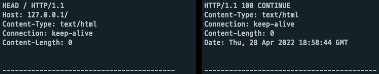
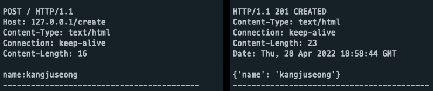
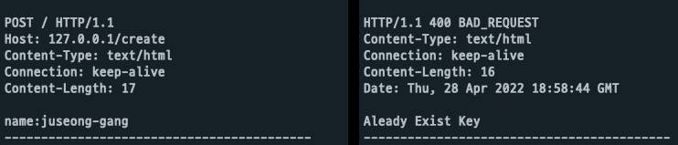
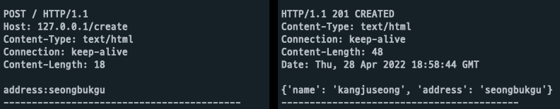
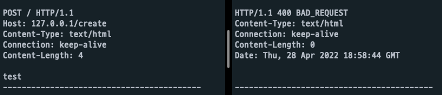
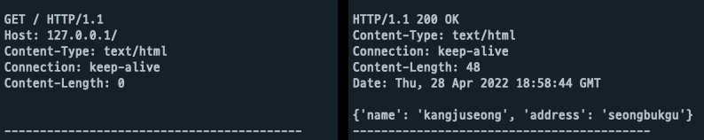
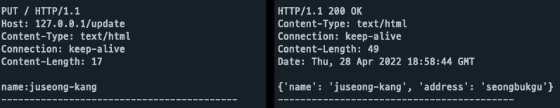
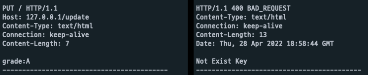
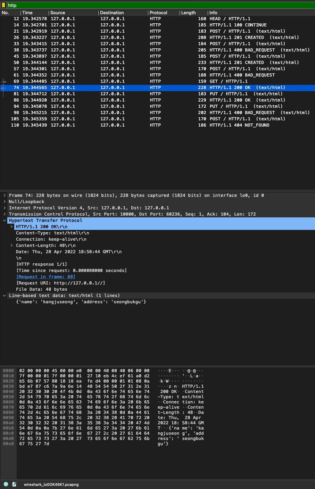

# CN_MidTerm_Socket_Project (20181569 강주성)

## TCP 기반 소켓 프로그램을 작성하고 HTTP1.1 프로토콜 방식 사용하여 Request/Response 구현

### 구조

- socket 통신을 이용하여 server와 client 간 통신 가능
- server에서 host와 port를 지정 후 server socket을 생성하여 대기
- client에서 server에서 사용한 host와 port를 통해 연결 된 socket 생성
- server에 연결된 client는 HTTP method와 url 주소를 보내서 응답 요청 (request)
- server에서는 client로부터 받은 HTTP method와 url을 검사하여 적절한 응답을 client로 전송 (response)
- client는 server로부터 받은 응답을 출력
- server에서 client로부터 요청에 대한 적절한 응답 코드와 응답 메시지 보내기
- 데이터베이스를 대신 해서 txt파일을 통해 데이터를 읽고 저장

### 동작 환경

- python 3.9
- server.py와 client.py를 분리하여 실행
- server.py에서 port는 10000을 사용하고 localhost로 실행
- server.py가 실행 중이면 client.py를 실행하여 터미널에 출력되는 결과 확인

### 코드

1. server.py

    - socket 통신에 필요한 모듈 가져오기
    - HTTP header에 들어갈 날짜를 가져올 모듈 가져오기
    - DB 파일을 관리해줄 모듈 가져오기

        ```python
        form socket import *
        import time
        from DBManager import DataBaseManager
        ```

    - host와 port, size를 변수에 저장
    - status code와 status message를 배열에 저장
    - status code와 status message를 indexing 하기 위한 변수 선언

        ```python
        HOST = "127.0.0.1"
        PORT = 10000
        SIZE = 1024

        CONTINUE = 0
        OK = 1
        CREATED = 2
        BAD_REQUEST = 3
        NOT_FOUND = 4
        STATUS_CODE = ['100', '200', '201', '400', '404']
        STATUS_MESSAGE = ['CONTINUE', 'OK', 'CREATED', 'BAD_REQUEST', 'NOT_FOUND']

        ```  

    - 매개변수로 받은 문자열에서 HTTP method를 추출하는 함수

        ```python
        def find_http_method(line):
            line = line.split(' ')
            return line[0]
        ```  

    - 매개변수로 status code와 status message 그리고 body에 들어갈 값 가져오기
    - 가져온 값을 HTTP1.1 response 양식에 대입하고 해당 response를 return 해주는 함수

        ```python
        def response_formating(status_code, status_msg, body=''):
            date = time.strftime('%a, %d %b %Y %H:%M:%S GMT', time.localtime(time.time()))
            return f"HTTP/1.1 {status_code} {status_msg}\r\nContent-Type: text/html\r\nConnection: keep-alive\r\nContent-Length: {len(body)}\r\nDate: {date}\r\n\n{body}"
        ```  

    - 매개변수로 status와 body를 받아와서 해당 상태에 적절한 response를 return 해주는 함수

        ```python
        def response(status, body=''):
            if status == CONTINUE:
                return response_formating(STATUS_CODE[CONTINUE], STATUS_MESSAGE[CONTINUE], body)
            if status == OK:
                return response_formating(STATUS_CODE[OK], STATUS_MESSAGE[OK], body)
            elif status == CREATED:
                return response_formating(STATUS_CODE[CREATED], STATUS_MESSAGE[CREATED], body)
            elif status == BAD_REQUEST:
                return response_formating(STATUS_CODE[BAD_REQUEST], STATUS_MESSAGE[BAD_REQUEST], body)
            if status == NOT_FOUND:
                return response_formating(STATUS_CODE[NOT_FOUND], STATUS_MESSAGE[NOT_FOUND], body)
        ```  

    - client로 부터 들어온 request를 적절한 path와 method에 연결시켜주는 함수
    - 존재하지 않는 path가 요청되거나 잘못된 method 요청에 대한 처리를 해주는 기능 구현

        ```python
        def router(url, method, body):
            if '/' in url:
                host, path = url.split('/')
                if host == HOST:
                    if method == 'HEAD': return head()
                    if method == 'GET': return get()
                    if path == 'create':
                        if method == 'POST': return post(body)
                        else: return response(BAD_REQUEST)
                    elif path == 'update':
                        if method == 'PUT': return put(body)
                        else: return response(BAD_REQUEST)
                    else: return response(NOT_FOUND)
                else:
                    return ''
            else:
                return response(NOT_FOUND)
        ```  

    - GET method 요청이 들어왔을 때 실행되는 함수
    - DB파일에 있는 데이터를 전부 읽어와서 리턴해주는 `selectDB()` 함수
    - status는 OK

        ```python
        def get():
            dbm = DataBaseManager()
            res = dbm.selectDB()
            return response(OK, body=str(res))
        ```  

    - HEAD method에 대한 응답 함수
    - body에 추가적인 데이터가 없고 HTTP header만을 보내주고 status 는 CONTINUE

        ```python
        def head():
            return response(CONTINUE) 
        ```  

    - POST method에 대한 응답 함수
    - POST는 새로운 데이터를 추가하려는 의미로 body로 들어온 데이터를 `insertDB(key, value)` 함수를 통해 추가
    - body로 들어온 데이터의 양식이 `key:value`형태가 아니라면 잘못된 요청으로 판단하여 BAD_REQUEST를 return
    - 데이터가 성공적으로 삽입되었다면 OK를 return
    - `inserDB(key, value)` 가 error message를 날린다면 데이터 추가를 실패했으므로 BAD_REQUEST 응답과 함께 body에 error message 추가

        ```python
        def post(body):
            body = body.split(':')
            if len(body) == 2:
                dbm = DataBaseManager()
                res = dbm.insertDB(body[0], body[1])
                if type(res) is not str:
                    return response(CREATED, body=str(res))
            else:
                return response(BAD_REQUEST, body=res)
        else:
            return response(BAD_REQUEST)
        ```  

    - PUT method에 대한 응답 함수
    - PUT은 기존에 있는 데이터를 변경하는 의미로 body에서 key에 해당하는 value를 `updateDB(key, value)`함수를 통해 수정
    - body로 들어온 데이터의 양식이 `key:value`형태가 아니라면 잘못된 요청으로 판단하여 BAD_REQUEST를 return 
    - body로 들어온 데이터에서 key 값이 DB_DATA에 존재하지 않으면 수정할 수 없으므로 BAD_REQUEST를 return
    - 데이터가 성공적으로 변경되었다면 OK를 return
    - `updateDB(key, value)` 가 error message를 날린다면 데이터 수정에 실패했으므로 BAD_REQUEST 응답과 함께 body에 error message 추가

        ```python
        def put(body):
            body = body.split(':')
            if len(body) == 2:
                dbm = DataBaseManager()
        	    res = dbm.updateDB(body[0], body[1])
                if type(res) is not str:
                    return response(OK, body=str(res))
                else:
                    return response(BAD_REQUEST, body=res)
            else:
                return response(BAD_REQUEST)
        ```  

    - 지정한 HOST와 PORT를 이용하여 socket을 생성
    - `listen(1)` 메서드를 통해 socket 대기 상태

        ```python
        with socket(AF_INET, SOCK_STREAM) as server_socket:
            server_socket.bind((HOST, PORT))  # 생성한 소켓에 HOST와 PORT 바인딩
            server_socket.listen(1)  # 소켓 연결 대기 상태
        ```  

    - `accept()` 메소드를 통해 연결된 client의 socket과 address 저장
    - `recv(SIZE)` 메소드를 통해 client에서 보낸 HTTP request를 data변수에 저장
    - data 변수에서 client가 요청한 HTTP method, Host, body 정보를 추출
    - 추출한 method, url, body 를 `router()` 함수에 넣고 적잘한 response를 return 받아 res 변수에 저장
    - `send(res)` 메소드를 통해 요청에 대한 적절한 응답을 client로 전송

        ```python
            while True:
                client_socket, client_addr = server_socket.accept()  # 소켓이 연결 될 떄 client의 소켓과 주소 반환
                
                data = client_socket.recv(SIZE).decode('utf-8')  # client에서 보내는 데이터 받기
                print(data)
                data = data.split('\n')
                method = find_http_method(data[0])
                url = data[1][6:-1]
                body = data[-1]
                res = router(url, method, body)

                client_socket.send(response.encode('utf-8'))  # 데이터 인코딩하여 보내기
        ```  

2. client.py

    - socket 통신에 필요한 모듈 import

        ```python
        form socket import *
        ```  

    - 연결할 서버의 IP와 PORT를 변수에 저장
    - 데이터 사이즈를 SIZE 변수에 저장

        ```python
        IP = "127.0.0.1"
        PORT = 10000
        SIZE = 1024
        ```  

    - test_case 배열에 딕셔너리 형태의 method, url, body를 담은 test case를 저장

        ```python
        test_case = [
            {'url': '127.0.0.1/',
             'method': 'HEAD',
             'body': ''
            },
            {'url': '127.0.0.1/create',
             'method': 'POST',
             'body': 'name:kangjuseong'
            },
            {'url': '127.0.0.1/create',
             'method': 'POST',
             'body': 'name:juseong-gang'
            },
            {'url': '127.0.0.1/create',
             'method': 'POST',
             'body': 'address:seongbukgu'
            },
            {'url': '127.0.0.1/create',
             'method': 'POST',
             'body': 'test'
            },
            {'url': '127.0.0.1/',
             'method': 'GET',
             'body': ''
            },
            {'url': '127.0.0.1/update',
             'method': 'PUT',
             'body': 'name:juseong-kang'
            },
            {'url': '127.0.0.1/update',
             'method': 'PUT',
             'body': 'grade:A'
            },
            {'url': '127.0.0.1/test',
             'method': 'POST',
             'body': 'age:24'
            }
        ]
        ```  

    - 유저가 요청하는 method와 url 그리고 body 데이터를 매개변수로 받기
    - 받은 값들을 HTTP1.1 포맷에 담아 request 데이터를 return 해주는 함수

        ```python
        def request_formating(method, body, url):
            return f"{method} / HTTP/1.1\r\nHost: {url}\r\nAccept: text/html\r\nContent-Type: text/html\r\nConnection: keep-alive\r\nContent-Length: {len(body)}\r\n\n{body}"
        ```  

    - request 데이터를 갖고있는 test_case 개수만큼 반복 실행
    - 소켓을 생성하고 IP와 PORT를 설정하여 server socket에 연결

        ```python
            for test in test_case:
                with socket(AF_INET, SOCK_STREAM) as client_socket:
                    client_socket.connect((IP, PORT))  # 생성한 소켓에 HOST와 PORT 연결
        ```  

    - server로 요청할 request test case를 `request_formating()` 함수에 인자로 삽입
    - `request_formating()` 함수에서 반환된 값을 request 변수에 저장
    - request 데이터를 인코딩 후 `send()` 메소드를 이용하여 서버로 request를 전송

        ```python
                    method = test['method']
                    url = test['url']
                    body = test['body']
                    request = request_formating(method, body, url)
                    client_socket.send(request.encode('utf-8'))
        ```  

    - server로 부터 돌아온 응답을 `recv()` 메소드를 통해 받아오기
    - 받아온 response 출력 후 socket 종료

        ```python
                    data = client_socket.recv(SIZE).decode('utf-8')
                    print("Response data : ", data)
                    client_socket.close()
        ```  

3. DBManager.py

    - DB로 사용할 DB.txt 파일의 경로 저장
    - txt 파일을 DataBase 처럼 이용할 수 있게 해주는  DataBaseManager 클래스 작성
    - txt 파일에 문자열 형태로 저장 후 읽을 때는 dict 형태로 변환하여 사용
    - DataBase 특성 상 primary key를 가져야 하는데 여기서는 key 값을 primary key로 가정

        ```python
        DB_PATH = "./DB.txt"


        class DataBaseManager():
            def __init__(self):
                self.db = open(DB_PATH, 'r')
        ```

    - txt 파일에서 데이터를 읽어오는 함수

        ```python
            def readData(self):
                self.db = open(DB_PATH, 'r')
                data = self.db.readlines()
                self.disConnect()
                return data
        ```

    - txt 파일에 데이터를 쓰는 함수

        ```python
            def writeData(self, data):
                self.db = open(DB_PATH, 'w')
                self.db.write(data정
                self.disConnect()
        ```

    - txt 파일에서 읽어 온 데이터를 dict 형태로 변환하여 반환해주는 함수

        ```python
            def selectDB(self):
                data = {}
                read_data = self.readData()
                for line in read_data:
                    line = line[:-1]
                    k, v = line.split(':')
                    data[k] = v
                return data
        ```

    - dict 형태로 반환 된 데이터에 매개변수로 받은 데이터를 추가하고 해당 데이터를 txt 파일에 쓰는 함수
    - key값이 이미 존재하면 Aleady Exist Data 라는 에러 메시지 반환

        ```python
            def insertDB(self, insert_k, insert_v):
                data = self.selectDB() 
                str_data = ""
                insert_flag = True
                for k, v in data.items():
                    if k == insert_k:
                        insert_flag = False
                    str_data += f"{k}:{v}\n"
                if insert_flag:
                    str_data += f"{insert_k}:{insert_v}\n"
                self.writeData(str_data)
                
                if insert_flag:
                    return self.selectDB()
                else:
                    return "Aleady Exist Key"
        ```

    - dict 형태로 반환 된 데이터에 매개변수로 받은 key가 존재하는지 확인 후 존재하면 해당 key의 value를 매개변수로 받은 값으로 수정
    - DB에 매개변수로 받은 key가 존재하지 않을 경우 Not Exist Key 라는 에러 메시지를 반환

        ```python
            def updateDB(self, target_k, update_v):
                data = self.selectDB()
                str_data = ""
                update_flag = False
                for k, v in data.items():
                    if k == target_k:
                        str_data += f"{target_k}:{update_v}\n"
                        update_flag = True
                    else:
                        str_data += f"{k}:{v}\n"
                self.writeData(str_data)

                if update_flag:
                    return self.selectDB() 
                else:
                    return "Not Exist Key
        ```

### 결과

1. 좌측은 client로 부터 온 request, 우측은 server로 부터 온 response
2. post, put 요청 시 데이터를 request body에 넣어 전송, server에서 해당 데이터를 저장 또는 수정하고 현재 저장되어 있는 데이터를 response body에 넣어 전송
3. 잘못된 요청에 대한 400 or 404 응답

    - case 1
        - HEAD method 요청과 그에 대한 응답
        - HEAD는 response에 header만 표시하며 보통 서버가 열려있는지 확인하는 용도로 사용
        

    - case 2
        - POST method 요청과 그에 대한 응답
        - POST는 client가 body에 데이터를 넣고 요청하면 server에서 해당 데이터를 DB로 추가하는 용도로 사용
        - 데이터 추가가 잘 되었다면 201 CREATED 라는 상태 코드와 상태 메시지가 응답으로 반환
        - 응답에 body에 있는 데이터는 추가하려는 데이터가 잘 들어갔는지 확인하기 위해 전체 데이터를 server에서 반환
        

    - case 3
        - POST method 요청과 그에 대한 응답
        - 추가하려는 데이터가 이미 존재하기 때문에 추가할 수 없어 응답으로 400 BAD_REQUEST가 반환된것을 확인
        - 응답 body에는 어떤 이유로 요청이 실패했는지 에러 메시지 출력
        

    - case 4
        - case 2와 동일하게 POST method를 통해 body에 있는 데이터를 DB에 추가
        - 응답 코드와 메시지로 201 CREATED 가 반환 된것을 확인
        - 응답 body를 통해 데이터가 잘 추가된 것을 확인
        

    - case 5
        - case 2와 요청 method는 동일하지만 body에 있는 데이터가 server에서 원하는 데이터 양식과 달라 BAD_REQUEST가 반환된 것을 확인
        

    - case 6
        - GET method 요청과 그에 대한 응답
        - GET은 DB에 있는 데이터를 읽어 오는 용도로 사용
        - 이전에 POST로 추가했던 데이터들을 가져와서 응답 body를 통해 반환
        

    - case 7
        - PUT method 요청과 그에 대한 응답
        - PUT은 DB에 있는 데이터를 client가 보낸 데이터로 수정하는 용도로 사용
        - client가 보낸 데이터의 key에 해당하는 DB의 value를 client가 보낸 value로 수정
        - 수정이 잘 되었는지 확인하기 위해 DB의 데이터를 응답 body에 담아 반환
        

    - case 8
        - case 7과 요청 method는 동일하지만 DB에서 grade라는 key를 가진 데이터는 없으므로 수정할 수 없기 때문에 BAD_REQUEST가 반환된 것을 확인
        - 응답 body에는 요청이 실패한 이유를 알려주는 에러 메시지가 반환
        

    - case 9
        - POST method를 요청했지만 host 뒤에 붙은 path는 server의 router에서 처리하고 있지 않는 path 이므로 NOT_FOUND가 반환된 것을 확인
        

4. wireshark를 통해 보이는 client와 server(10000)간 통신
 
