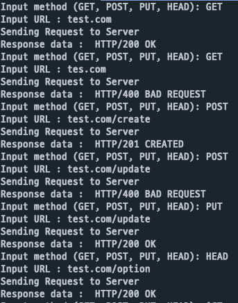
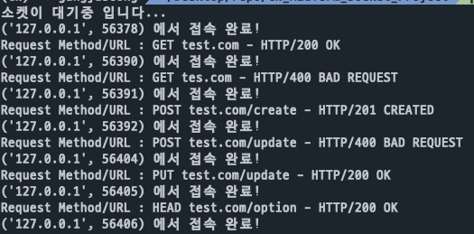
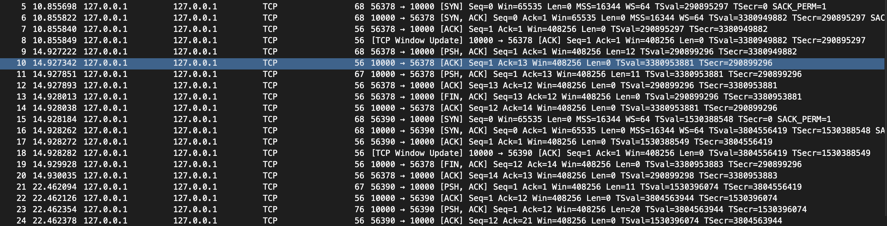
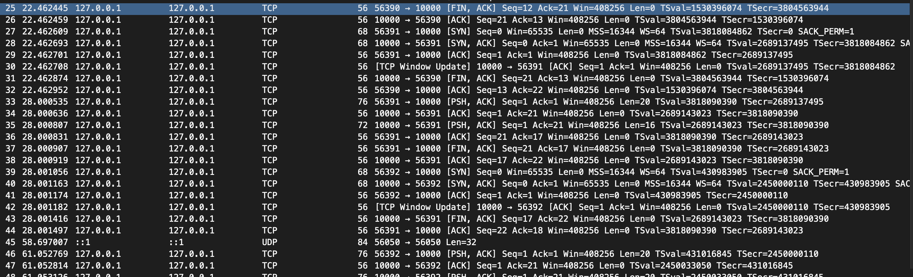
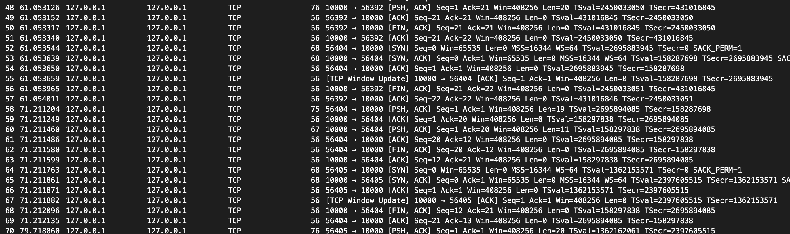
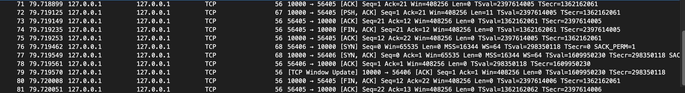

# CN_MidTerm_Socket_Project
## TCP 기반 소켓 프로그램을 작성하고 HTTP1.1 프로토콜 방식 사용하여 Request/Response 구현

### 구조

- socket 통신을 이용하여 server와 client 간 통신 가능
- server에서 host와 port를 지정 후 server socket을 생성하여 대기
- client에서 server에서 사용한 host와 port를 통해 연결 된 socket 생성
- server에 연결된 client는 HTTP method와 url 주소를 보내서 응답 요청 (request)
- server에서는 client로부터 받은 HTTP method와 url을 검사하여 적절한 응답을 client로 전송 (response)
- client는 server로부터 받은 응답을 출력
- server에서 client로부터 요청에 대한 적절한 응답 코드와 응답 메시지 보내기
    
### 코드

1. server.py

    - socket 통신에 필요한 모듈 가져오기
    - HTTP header에 들어갈 날짜를 가져올 모듈 가져오기
        ```python
        form socket import *
        import time
        ```  
  

    - host와 port, size를 변수에 저장
    - status code와 status message를 배열에 저장
    - status code와 status message를 indexing 하기 위한 변수 선언
    - `POST`와 `PUT` method를 통해 데이터를 추가하고 변경할 때 이용할 DB_DATA 딕셔너리 선언
        ```python
        HOST = "127.0.0.1"
        PORT = 10000
        SIZE = 1024

        CONTINUE = 0
        OK = 1
        CREATED = 2
        BAD_REQUEST = 3
        NOT_FOUND = 4
        STATUS_CODE = ['100', '200', '201', '400', '404']
        STATUS_MESSAGE = ['CONTINUE', 'OK', 'CREATED', 'BAD_REQUEST', 'NOT_FOUND']

        DB_DATA = {}
        ```  
  


    - 매개변수로 받은 문자열에서 HTTP method를 추출하는 함수
        ```python
        def find_http_method(line):
            line = line.split(' ')
            return line[0]
        ```  
  

    - 매개변수로 status code와 status message 그리고 body에 들어갈 값 가져오기
    - 가져온 값을 HTTP1.1 response 양식에 대입하고 해당 response를 return 해주는 함수
        ```python
        def response_formating(status_code, status_msg, body=''):
            date = time.strftime('%a, %d %b %Y %H:%M:%S GMT', time.localtime(time.time()))
            return f"HTTP/1.1 {status_code} {status_msg}\r\nContent-Type: text/html\r\nConnection: keep-alive\r\nContent-Length: {len(body)}\r\nDate: {date}\r\n\n{body}"
        ```  
  

    - 매개변수로 status와 body를 받아와서 해당 상태에 적절한 response를 return 해주는 함수
        ```python
        def response(status, body=''):
            if status == CONTINUE:
                return response_formating(STATUS_CODE[CONTINUE], STATUS_MESSAGE[CONTINUE], body)
            if status == OK:
                return response_formating(STATUS_CODE[OK], STATUS_MESSAGE[OK], body)
            elif status == CREATED:
                return response_formating(STATUS_CODE[CREATED], STATUS_MESSAGE[CREATED], body)
            elif status == BAD_REQUEST:
                return response_formating(STATUS_CODE[BAD_REQUEST], STATUS_MESSAGE[BAD_REQUEST], body)
            if status == NOT_FOUND:
                return response_formating(STATUS_CODE[NOT_FOUND], STATUS_MESSAGE[NOT_FOUND], body)
        ```  
  

    - client로 부터 들어온 request를 적절한 path와 method에 연결시켜주는 함수
    - 존재하지 않는 path가 요청되거나 잘못된 method 요청에 대한 처리를 해주는 기능 구현
        ```python
        def router(url, method, body):
            if '/' in url:
                host, path = url.split('/')
                if host == HOST:
                    if method == 'HEAD': return head()
                    if path == 'index.html':
                        if method == 'GET': return get()
                        else: return response(BAD_REQUEST)
                    elif path == 'create':
                        if method == 'POST': return post(body)
                        else: return response(BAD_REQUEST)
                    elif path == 'update':
                        if method == 'PUT': return put(body)
                        else: return response(BAD_REQUEST)
                    else: return response(NOT_FOUND)
                else:
                    return ''
            else:
                return response(NOT_FOUND)
        ```  
  

    - index.html에 대한 path와 GET method 요청이 들어왔을 때 실행되는 함수
    - body에 index.html 문자열을 넣고 응답
    - status는 OK
        ```python
        def get():
            return response(OK, body='index.html')
        ```  
  

    - HEAD method에 대한 응답 함수
    - body에 추가적인 데이터가 없고 HTTP header만을 보내주고 status 는 CONTINUE
        ```python
        def head():
            return response(CONTINUE) 
        ```  
  

    - POST method에 대한 응답 함수
    - POST는 새로운 데이터를 추가하려는 의미로 DB_DATA 딕셔너리에 body로 들어온 데이터를 삽입
    - body로 들어온 데이터의 양식이 `key:value`형태가 아니라면 잘못된 요청으로 판단하여 BAD_REQUEST를 return
    - 데이터가 성공적으로 삽입되었다면 OK를 return
        ```python
        def post(body):
            k, v = body.split(':')
            if type(k) is str and type(v) is str:
                DB_DATA[k] = v
                return response(CREATED, body=str(DB_DATA))
            else:
                return response(BAD_REQUEST)
        ```  
  

    - PUT method에 대한 응답 함수
    - PUT은 기존에 있는 데이터를 변경하는 의미로 DB_DATA 딕셔너리에 body로 들어온 데이터로 수정
    - body로 들어온 데이터의 양식이 `key:value`형태가 아니라면 잘못된 요청으로 판단하여 BAD_REQUEST를 return 
    - body로 들어온 데이터에서 key 값이 DB_DATA에 존재하지 않으면 수정할 수 없으므로 BAD_REQUEST를 return
    - 데이터가 성공적으로 변경되었다면 OK를 return
        ```python
        def put(body):
            k, v = body.split(':')
            if type(k) is str and type(v) is str:
                if k in DB_DATA.keys():
                    DB_DATA[k] = v
                    return response(OK, body=str(DB_DATA))
                else:
                    return response(BAD_REQUEST, body='Not Exist Data')
            else:
                return response(BAD_REQUEST)
        ```  
  

    - 지정한 HOST와 PORT를 이용하여 socket을 생성
    - `listen(1)` 메서드를 통해 socket 대기 상태
        ```python
        with socket(AF_INET, SOCK_STREAM) as server_socket:
            server_socket.bind((HOST, PORT))  # 생성한 소켓에 HOST와 PORT 바인딩
            server_socket.listen(1)  # 소켓 연결 대기 상태
        ```  
  

    - `accept()` 메소드를 통해 연결된 client의 socket과 address 저장
    - `recv(SIZE)` 메소드를 통해 client에서 보낸 HTTP request를 data변수에 저장
    - data 변수에서 client가 요청한 HTTP method, Host, body 정보를 추출
    - 추출한 method, url, body 를 `router()` 함수에 넣고 적잘한 response를 return 받아 res 변수에 저장
    - `send(res)` 메소드를 통해 요청에 대한 적절한 응답을 client로 전송
        ```python
            while True:
                client_socket, client_addr = server_socket.accept()  # 소켓이 연결 될 떄 client의 소켓과 주소 반환
                
                data = client_socket.recv(SIZE).decode('utf-8')  # client에서 보내는 데이터 받기
                print(data)
                data = data.split('\n')
                method = find_http_method(data[0])
                url = data[1][6:-1]
                body = data[-1]
                res = router(url, method, body)

                client_socket.send(response.encode('utf-8'))  # 데이터 인코딩하여 보내기
        ```  
  

2. client.py

    - socket 통신에 필요한 모듈 import
        ```python
        form socket import *
        ```  
  

    - 연결할 서버의 IP와 PORT를 변수에 저장
    - 데이터 사이즈를 SIZE 변수에 저장
        ```python
        IP = "127.0.0.1"
        PORT = 10000
        SIZE = 1024
        ```  

  
    - test_case 배열에 딕셔너리 형태의 method, url, body를 담은 test case를 저장
        ```python
        test_case = [
            {'url': '127.0.0.1/index.html',
            'method': 'GET',
            'body': ''
            },
            {'url': '127.0.0.1/test.html',
            'method': 'GET',
            'body': ''
            },
            {'url': '127.0.0.1/',
            'method': 'HEAD',
            'body': ''
            },
            {'url': '127.0.0.1/create',
            'method': 'POST',
            'body': 'name:kangjuseong'
            },
            {'url': '127.0.0.1/create',
            'method': 'POST',
            'body': 'address:seongbukgu'
            },
            {'url': '127.0.0.1/create',
            'method': 'POST',
            'body': 'test'
            },
            {'url': '127.0.0.1/update',
            'method': 'PUT',
            'body': 'name:juseong-kang'
            },
            {'url': '127.0.0.1/update',
            'method': 'PUT',
            'body': 'grade:10'
            },
            {'url': '127.0.0.1/test',
            'method': 'POST',
            'body': 'test:test'
            }
        ]
        ```  
  

    - 유저가 요청하는 method와 url 그리고 body 데이터를 매개변수로 받기
    - 받은 값들을 HTTP1.1 포맷에 담아 request 데이터를 return 해주는 함수
        ```python
        def request_formating(method, body, url):
            return f"{method} / HTTP/1.1\r\nHost: {url}\r\nAccept: text/html\r\nContent-Type: text/html\r\nConnection: keep-alive\r\nContent-Length: {len(body)}\r\n\n{body}"
        ```  
  

    - request 데이터를 갖고있는 test_case 개수만큼 반복 실행
    - 소켓을 생성하고 IP와 PORT를 설정하여 server socket에 연결
        ```python
            for test in test_case:
                with socket(AF_INET, SOCK_STREAM) as client_socket:
                    client_socket.connect((IP, PORT))  # 생성한 소켓에 HOST와 PORT 연결
        ```  
  

    - server로 요청할 request test case를 `request_formating()` 함수에 인자로 삽입
    - `request_formating()` 함수에서 반환된 값을 request 변수에 저장
    - request 데이터를 인코딩 후 `send()` 메소드를 이용하여 서버로 request를 전송
        ```python
                    method = test['method']
                    url = test['url']
                    body = test['body']
                    request = request_formating(method, body, url)
                    client_socket.send(request.encode('utf-8'))
        ```  
  

    - server로 부터 돌아온 응답을 `recv()` 메소드를 통해 받아오기
    - 받아온 response 출력 후 socket 종료
        ```python
                    data = client_socket.recv(SIZE).decode('utf-8')
                    print("Response data : ", data)
                    client_socket.close()
        ```  
  

### 결과
1. client에서 보내는 request 입력 및 server로 부터 온 response 출력


2. server로 접속된 socket 및 client request에 대한 response 출력


 3. wireshark를 통해 보이는 client와 server(10000)간 통신






